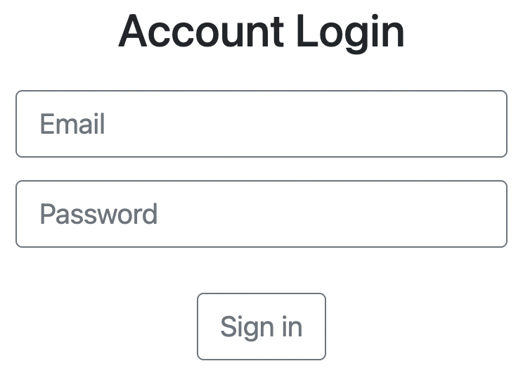

# 帳密檢查機制



## 介紹

驗證帳密是否符合資料庫的帳密，資料定義在 users.js 中

## 功能

1. 登入與登出
2. 保持登入狀態

## 開始使用

1. 請先確認有安裝 node.js 與 npm
2. 將專案 clone 到本地
3. 在本地開啟之後，透過終端機進入資料夾，輸入：

   ```bash
   npm install
   ```

4. 安裝完畢後，繼續輸入：

   ```bash
   npm run start
   ```

5. 若看見此行訊息則代表順利運行，打開瀏覽器進入到以下網址

   ```bash
   Listening on http://localhost:3000
   ```

6. 若欲暫停使用

   ```bash
   ctrl + c
   ```

## 開發工具

- node.js 14.18.0
- express 4.17.3
- express-Handlebars 4.0.2
- mongoDB 資料庫
- mongoose 6.2.3